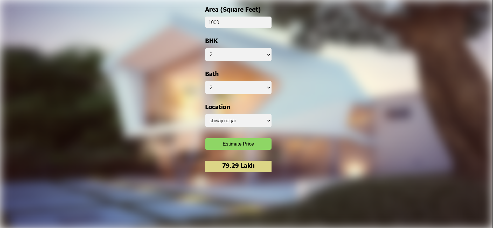

# Bangalore House Price Prediction

A simple machine learning project to predict house prices in Bangalore based on square footage, BHK, bathrooms, and location.

## How It Works
- A **Linear Regression Model** trained on real estate data to estimate home prices.
- A **Flask API** serves predictions through two endpoints.
- A **User-Friendly Interface** built with HTML, CSS, and JavaScript for easy interaction.

## Screenshot


## API Endpoints
### **GET** `/get_location_names`
**Response:**
```json
{
    "locations": ["1st block jayanagar", "Rajaji Nagar", "neeladri nagar", "nehru nagar", "Whitefield", "vidyaranyapura", "vijayanagar"]
}
```

### **POST** `/predict_home_price`
**Request Parameters:**
- `total_sqft` (float)
- `bhk` (int)
- `bath` (int)
- `location` (string)

**Response:**
```json
{
    "estimated_price": 75.5
}
```

## To-Do
- Improve UI design
- Add better error handling
- Deploy on a cloud platform

## Author
[Harsh](https://github.com/Harsh13dev)
